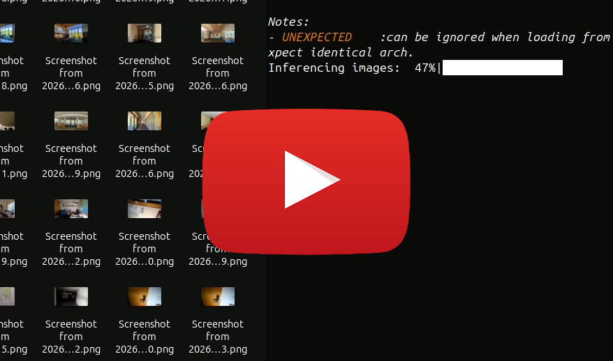

# AI Auto Image Renamer

Ai Auto Image Renamer is a lightweight Python tool that uses an AI image‑to‑text model (BLIP) to read the contents of photos and automatically rename them with descriptive titles.  

It’s perfect for bulk processing of large collections of poorly named images – e.g.

``` Bash
DCIM_5486200547.jpg → Pool_in_the_exterior_with_grass_and_lawn.jpg.
```
## Video Showcase
[ ]( https://www.youtube.com/watch?v=LBOxcWDih8s )

# Installation

### 1 - Clone the repository
```bash
git clone https://github.com/RayznGames/AI-Bulk-Image-Rename.git
cd AI-Bulk-Image-Rename
```

### 2 - Create your Virtual Environment
```bash
python3 -m venv .venv
source .venv/bin/activate
```
### 3 - Install dependencies

```bash
pip install -r requirements.txt
``` 
Or
```bash
pip install torch pillow tqdm transformers
``` 
> **Tip**: If you want to use a GPU for inference, make sure you have a compatible CUDA installation.
---

# Model Files Base (Reccommended)

## 1 - First Run - Download
The script by default will **automatically download the BLIP‑Base model** from the Hugging Face repository 

Once you run the script for the first time the downloaded model is stored in a folder named `ModelFiles` located next to the script.  
If you wish to use a different directory, change the `CACHE_PATH` variable in the top of the script.

```bash
SUPPORTED_EXTENSIONS = {".png", ".jpg", ".jpeg", ".exr", ".tga"}
CACHE_PATH = "ModelFiles" <----------------Here!
MAX_RENAME_ATTEMPTS = 1000
FILTER_START_OUTPUT = {"a ","an ","the " , "of a ", "image of a ", "illustration of a ", "black and white", "icon of a "}
PROMPT_TEXT = "This picture shows" 
```

You can change:
- **SUPPORTED EXTENSIONS** - _The supported image extensions to your own needs to avoid renaming certain filetypes._
- **MAX RENAME ATTEMPTS** - _Hard limit of images with name + N (last N being the hard limit)_
- **FILTER START OUTPUT** - _Filter words from appearing in the beggining of the output, (Is additive)_
- **PROMPT TEXT** - _The prompt used for steering image-to-text Captioning Inference_

## 2- Offline usage
- After the first download, you can switch to offline mode for 0 HTTP requests by setting the flag **"TRANSFORMERS_OFFLINE"** to **1** in the OS environment 

- As well set to **TRUE** the localFiles bolean under **TRANSFORMERS_OFFLINE**

```python
# Makes sure we download or use only the local model files.
os.environ["TRANSFORMERS_OFFLINE"] = "1"
LOCAL_FILES:bool = True
```

## Or... Clone BLIP from Huggingface/Salesforce/blip-image-captioning-base
If you clone the model files repository to the ModelFiles folder you can go back to offline usage and set the offline variable to true

**Clone from:**
- `https://huggingface.co/Salesforce/blip-image-captioning-base`
- [` HuggingFace Salesforce BLIP Model` ]( https://huggingface.co/Salesforce/blip-image-captioning-base`)

By copying the downloaded BLIP model folder into the `ModelFiles` folder you will have your local model files and can run the script locally normally
# Model Files Coco (Not usable for consumer GPU's)
> **Note:**  _These model files are +20 gb and require +20Gb of VRAM or RAM to load the weights and run inference
this is only viable to use if you have a server or computer with the recources available to load them_

For the blip2-coco model. At the top of the script you will find instructions in how to replace the model loaded. with a hidden premade function.

After the replacement follow the **same download procedures** as with the base model.

> _**CAUTION:** The download time will be long be patient_

# Usage

```bash
python3 IMGrename.py </PATH_TO_IMAGES>
```
- **`</PATH_TO_IMAGES>`** – Folder containing all the images to be renamed. 

> For AI inference the **`device`** Defaults to **`CPU`**; and automatically uses **`CUDA`** if a GPU with CUDA is available.
### Example

```bash
python3 IMGrename.py ./photos
```
Once started will create a progress bar for all the image renames done
```
Inferencing Images - ■■□□□□□□- 54/255
```
After the script finishes, the program will `LOG` an output similar to:
```
...
Renaming: DCIM_5486200547.jpg → Pool_in_the_exterior_with_grass_and_lawn.jpg
Renaming: IMG_1234.png   → City_skyline_at_night_with_lights.png
```
---

## Customization

### Prompt Text

The caption is generated by prefixing a user‑defined prompt. Edit the `prompt_text` variable near the top of `rename_images.py`:

```python
prompt_text = "This picture shows"
```

> *Example*: `"Describe this scene:"` or `"A photo of:"`.

### Generation Parameters

All inference settings are passed to `model.generate()`.  
Feel free to tweak them for a trade‑off between speed, memory usage, and output quality.

```python
generated_ids = model.generate(
    **inputs,
    max_new_tokens=20,
    num_beams=25,
    min_length=2,
    repetition_penalty=1.75,
    no_repeat_ngram_size=20,
    early_stopping=True
)
```

Below is a quick reference table of all available arguments (taken from the Hugging Face `transformers` docs). 
- [` HuggingFace Transformers BLIP Docs` ]( https://huggingface.co/docs/transformers/v4.44.1/model_doc/blip#transformers.BlipForConditionalGeneration )

## Quick Config Table
- [`Table contents Source - BLIP pretrained Config Docs` ]( https://huggingface.co/docs/transformers/v4.44.1/en/main_classes/configuration#transformers.PretrainedConfig )

> Check **Parameters for sequence generation**

| Argument | Type | Default | What it does |
|----------|------|---------|--------------|
| **max_length** | `int` | depends on model (e.g., 20 for BLIP‑2) | Maximum total length of the generated sequence (`input_ids` + generated). If you set `max_new_tokens`, this is ignored. |
| **min_length** | `int` | 1 | Minimum number of tokens to generate (useful with beam search + early stopping). |
| **max_new_tokens** | `int` | None | How many *new* tokens to produce, regardless of the input length. Overrides `max_length`. |
| **num_beams** | `int` | 1 | Beam‑search width. 1 = greedy decoding. Larger values increase quality but also memory/time linearly. |
| **do_sample** | `bool` | False | If True, use sampling (top‑k/top‑p) instead of beam search. |
| **temperature** | `float` | 1.0 | Softens / sharpens the probability distribution when sampling. |
| **top_k** | `int` | 50 | Keep only the top‑k tokens for sampling. |
| **top_p** | `float` | 1.0 | Nucleus (top‑p) filtering – keep smallest set of tokens whose cumulative probability ≥ p. |
| **repetition_penalty** | `float` | 1.0 | Penalises repeated n‑grams / tokens during decoding. < 1 encourages repetition, > 1 discourages it. |
| **no_repeat_ngram_size** | `int` | 0 | Disallow any n‑gram of this size from appearing twice in the output. |
| **bad_words_ids** | `List[List[int]]` | None | List of token id sequences that should never appear in the generated text. |
| **pad_token_id** | `int` | model’s pad token | ID used for padding (important when using batch inference). |
| **bos_token_id** | `int` | model’s BOS token | Beginning‑of‑sentence token id. |
| **eos_token_id** | `int` | model’s EOS token | End‑of‑sentence token id. |
| **length_penalty** | `float` | 1.0 | Controls the influence of sequence length on beam scores (≥ 1 favours longer sequences). |
| **early_stopping** | `bool` | False | Stop decoding when all beams have reached an EOS token. |
| **num_return_sequences** | `int` | 1 | Number of distinct output sequences to generate per input (useful with sampling or beam search). |
| **output_scores** | `bool` | False | Return the log‑probs for each generated token. |
| **output_attentions** | `bool` | False | Return attention matrices from every decoder layer. |
| **output_hidden_states** | `bool` | False | Return hidden states from all decoder layers. |
| **return_dict_in_generate** | `bool` | False | If True, return a `GenerateOutput` object instead of just the token ids. |
| **forced_bos_token_id** | `int` | None | Force a specific token to be used as the first generated token (overrides model’s BOS). |
| **forced_eos_token_id** | `int` | None | Force a specific token to end the sequence. |
| **decoder_start_token_id** | `int` | None | Token id that signals the decoder to start generating (used in seq‑2‑seq models). |
| **use_cache** | `bool` | True | Whether to use past key/value states for faster decoding. |
| **logits_processor** | `List[LogitsProcessor]` | [] | Custom processors that can modify logits before sampling/beam search. |
| **stopping_criteria** | `StoppingCriteriaList` | [] | Custom stopping rules (e.g., stop after a certain token). |
| **num_beam_groups** | `int` | 1 | For *diverse beam search*: number of independent beam groups. |
| **diversity_penalty** | `float` | 0.0 | Penalty applied to encourage diversity between beam groups (used with `num_beam_groups`). |

>***This is just a broad example of the properties to change in the model for modygying the output quality and generation parameters. be careful when modifying such properties***

---

# Troubleshooting

| Symptom | Cause | Fix |
|---------|-------|-----|
| **CUDA out of memory** | GPU with limited VRAM Resources| Reduce `num_beams`, use CPU (`--device cpu`) or split the batch into smaller chunks or Free VRAM by deloading other loaded AI models or closing graphics related applications |
| **Model download fails** | Offline mode enabled during first run. | Make sure `TRANSFORMERS_OFFLINE= "0"` with `LOCAL_FILES= True` and that you have an internet connection when running for the first time. |
| **Missing dependencies** | **requirements.txt** not installed. | Run `pip install torch pillow tqdm transformers` or Run `pip install requirements.txt`|
| **Wrong file names after rename** | Prompt or generation parameters produce ambiguous captions. | Adjust `prompt_text` or customize generation parameters |

---

# Contributing

If you’d like to add extra features, feel free to open an issue or submit a PR.

---

## License

MIT © 2026 RayznGames  
See the [LICENSE](LICENSE) file for details.

---

## Acknowledgements

- The **BLIP** model from the **[Hugging Face 🤗]** Transformers library. 
    - [BLIP AI Model](https://huggingface.co/Salesforce/blip-image-captioning-base)
- The authors of the BLIP paper: [ ***Junnan Li  |  Dongxu Li | Caiming Xiong  |  Steven Hoi***]
    - [Paper Arxiv](https://arxiv.org/abs/2201.12086 )
- All contributors to the open‑source ecosystem that made this tool possible.

Happy renaming!
